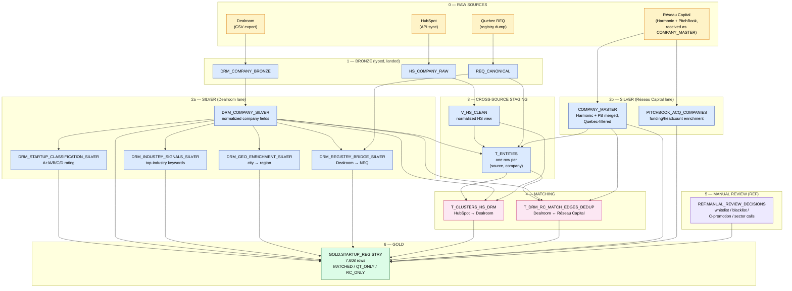

# Quebec Tech — Data Pipeline Overview

**Audience:** non-technical collaborators who need to understand where our startup registry comes from, what we do to the data at each stage, and why.

**Last updated:** 2026-04-13

> This doc is rendered as Markdown with a Mermaid diagram. In GitHub, Notion, and most Markdown viewers the diagram appears as a picture. In a plain text editor you'll see the code block.

---

## TL;DR

We pull company data from **five external sources**, clean and classify each one in its own lane, then match rows across sources using a deterministic-first waterfall. The final output is a single table — `GOLD.STARTUP_REGISTRY` — that lists every Quebec startup we know about, with a flag for each source that confirmed it.

As of 2026-04-13 the registry contains **7,608 rows**: 2,659 matched in both Dealroom and Réseau Capital, 2,560 in Dealroom only, 2,389 in Réseau Capital only.

---

## The pipeline at a glance

---

## Stage-by-stage walkthrough

### 0 — Raw sources

| Source | How we receive it | What's in it | Why we use it |
|---|---|---|---|
| **Dealroom** | CSV export, loaded by `dealroom_loader.py` | ~11K company profiles with ratings, industries, funding, HQ city | Primary source of truth for the "this is a startup" signal. Our whitelist is Dealroom A+/A/B. |
| **HubSpot** | API sync via `hubspot_sync.py` | All companies we've touched in our CRM | CRM context — deal status, contacts, partnership history. Used to enrich but not to define the registry. |
| **Quebec REQ** | Public registry dump (`REGISTRE_NOMS`, `ENTREPRISES_EN_FONCTION`) | Every registered Quebec legal entity with NEQ | Gives us the official NEQ identifier — the only unambiguous way to tie a Dealroom company to its legal entity. |
| **Réseau Capital** | Delivered to us as pre-merged `COMPANY_MASTER` (Harmonic + PitchBook, Quebec-filtered) | ~5K Quebec companies with funding, headcount, sectors | Captures the **VC-funded / deal-driven** population. Complements Dealroom's broader coverage. |
| _(PitchBook / Harmonic direct)_ | _Phase 2 — not yet activated_ | | |

### 1 — Bronze

**What we do:** Type everything (strings → dates, text → numbers), light cleanup (trim, null out empty strings), no business logic. One row per source row.

**Why:** Raw CSVs are full of surprises — inconsistent date formats, stray whitespace, CSV-escaping artifacts. Bronze gives us a stable foundation where we can run `SELECT *` without crashing.

**Tables:** `DRM_COMPANY_BRONZE`, `HS_COMPANY_RAW`, `REQ_CANONICAL`.

### 2a — Silver: Dealroom lane

This is where Dealroom data gets turned into something useful.

| Table | What it does | Why |
|---|---|---|
| `DRM_COMPANY_SILVER` | Normalizes domains, parses employee ranges, extracts funding to USD | We need one canonical shape for Dealroom companies across all downstream queries. |
| `DRM_STARTUP_CLASSIFICATION_SILVER` | Runs our rule-based classifier (`STARTUP_CLASSIFY_DEALROOM_V5`) → assigns each company an **A+/A/B/C/D** rating. Applies manual overrides from `REF.DRM_MANUAL_OVERRIDES`. | We can't include everything Dealroom has — Dealroom tracks 11K Quebec companies but many aren't really startups. The rating is our scope filter. |
| `DRM_INDUSTRY_SIGNALS_SILVER` | Keyword-matches Dealroom industry tags against `REF.INDUSTRY_KEYWORDS` → picks one top industry per company | Dealroom assigns multiple overlapping tags; we need a single "top industry" for reporting. |
| `DRM_GEO_ENRICHMENT_SILVER` | Maps city → region/MRC/agglomeration via `REF.CITY_REGION_MAPPING_NORM` | Raw cities are inconsistent (Montréal/Montreal/Mtl). Needed for regional breakdowns in reports. |
| `DRM_REGISTRY_BRIDGE_SILVER` | Matches Dealroom companies to the Quebec registry to attach an **NEQ**, using a tiered waterfall (NEQ-if-present → name similarity → Soundex) | NEQ is the only stable identifier for Quebec legal entities. Unlocks cross-ref with any official dataset. |

### 2b — Silver: Réseau Capital lane

Réseau Capital sends us pre-merged data, so our silver stage here is light:

- **`COMPANY_MASTER`** — the merged Harmonic + PitchBook view, already filtered to Quebec by record type (`HARMONIC_ONLY` / `PB_ONLY` / `BOTH`).
- **`PITCHBOOK_ACQ_COMPANIES`** — PitchBook-specific enrichment (headcount, total raised, revenue, financing status).

**Why we don't classify this side:** Réseau Capital is deal-driven — if a company is in there, it's because someone actually raised VC. No further filtering needed.

### 3 — Cross-source staging

**Table:** `T_ENTITIES` — one row per `(source, company_id)`, normalized fields (name, domain, LinkedIn, NEQ), with **blocking keys** for fast matching.

**Why:** The matcher needs all sources in the same shape. `T_ENTITIES` is the common ground where Dealroom, HubSpot, REQ, and RC all look alike.

`V_HS_CLEAN` is a parallel view for HubSpot that strips French column names and normalizes fields.

### 4 — Matching

Two separate matching jobs run here. Both use the same **tiered waterfall**: try deterministic keys first, fall back to fuzzy name similarity.

#### `T_CLUSTERS_HS_DRM` — HubSpot ↔ Dealroom
Label-propagation clustering. Deterministic edges on **NEQ / domain / LinkedIn**, then adds fuzzy name edges with similarity ≥ 0.92. Output: for each cluster of rows that represent the same company, one cluster ID.

**Why clustering and not 1:1 matching?** HubSpot has duplicates (companies we re-entered over time), and one Dealroom profile can correspond to several HubSpot rows.

#### `T_DRM_RC_MATCH_EDGES_DEDUP` — Dealroom ↔ Réseau Capital
1:1 match per side. Waterfall:
1. **Domain** (tier 1) — normalized website match
2. **LinkedIn slug** (tier 2)
3. **Crunchbase slug** (tier 3)
4. **Name similarity** ≥ 0.85 (tier 4)

As of the last run: **2,857 matches** (25.7% of 11K Dealroom rows), distributed as 2,539 domain / 62 LinkedIn / 85 Crunchbase / 171 name-sim.

**Why the low match rate is normal:** Q1 diagnostics (2026-04-10) confirmed that rating-A Dealroom rows are dominated (95%) by bootstrapped companies with zero VC funding, and Réseau Capital is deal-driven. The population simply doesn't overlap much. This is a **coverage feature, not a bug** — it's why we do the outer join.

### 5 — Manual review

**Table:** `REF.MANUAL_REVIEW_DECISIONS` — append-only log of human calls on:

- **Match confirmations / rejections** — override a 63D edge
- **Startup confirmations / rejections** — whitelist or blacklist a company
- **Sector calls** — adjudicate gaming / pharma / services ambiguities

Pipeline consumes this via views (`V_MATCH_WHITELIST`, `V_STARTUP_BLACKLIST`, etc.) so decisions auto-apply on the next build.

**Why this exists:** Automated classification is ~95% right, but the last 5% needs a human and needs to be reversible. Decisions are append-only so we can always audit and roll back.

### 6 — Gold: the registry

**Table:** `GOLD.STARTUP_REGISTRY`. One row per unique company, tagged as `MATCHED`, `QT_ONLY`, or `RC_ONLY`.

**How it's built:**
1. **QT candidates** = Dealroom A+/A/B + C-rated-and-matched-to-RC (promoted) + manually whitelisted, minus blacklisted. Rich with NEQ, HubSpot link, region, top industry.
2. **RC universe** = all Quebec `COMPANY_MASTER` rows + PitchBook enrichment, minus blacklisted.
3. **Outer join** via `T_DRM_RC_MATCH_EDGES_DEDUP`:
   - DR row + RC row both present → `MATCHED`
   - DR row only → `QT_ONLY`
   - RC row only → `RC_ONLY`

Each row carries:
- **Inclusion reason** (`QT_INCLUSION_REASON`): `CLS_APLUS` / `CLS_A` / `CLS_B` / `C_PROMOTED_RC_MATCH` / `MANUAL_WHITELIST` / `RC_ONLY`
- **Effective rating** (`RATING_LETTER_EFFECTIVE`) after promotion/whitelist
- **Source coverage flags**: `HAS_DEALROOM`, `HAS_HUBSPOT`, `HAS_RC`, `HAS_REQ`, `N_SOURCES`
- **Conflict flags** for matched rows: name / domain / city / year / employee / low-confidence
- **Sector flags**: `FLAG_SECTOR_GAMING`, `FLAG_SECTOR_PHARMA_BIOTECH`, `FLAG_SECTOR_SERVICES`
- **Review state**: `IS_STARTUP_WHITELISTED`, `IS_STARTUP_BLACKLISTED`
- **Review rollup**: `FLAG_NEEDS_REVIEW` — any flag above → surface to triage queue

---

## Row-count waypoints (2026-04-13)

### Raw / Silver — what each source brings to the table

| Stage | Table | Row count | Note |
|---|---|---:|---|
| Silver (DR) | `DRM_COMPANY_SILVER` | **11,136** | every Quebec company Dealroom tracks |
| Silver (DR) | `DRM_STARTUP_CLASSIFICATION_SILVER` — A+ | **198** | top-tier startups |
| Silver (DR) | `DRM_STARTUP_CLASSIFICATION_SILVER` — A | **2,376** | core startups |
| Silver (DR) | `DRM_STARTUP_CLASSIFICATION_SILVER` — B | **1,621** | borderline startups |
| Silver (DR) | `DRM_STARTUP_CLASSIFICATION_SILVER` — C | **5,277** | non-startup signal, eligible for promotion |
| Silver (DR) | `DRM_STARTUP_CLASSIFICATION_SILVER` — D | **1,664** | clearly not startups |
| Silver (DR) | `DRM_REGISTRY_BRIDGE_SILVER` — with NEQ | **8,375** / 11,136 | 75% of DR companies linked to REQ |
| Silver (RC) | `COMPANY_MASTER` — `HARMONIC_ONLY` | **2,984** | Harmonic long-tail scraping |
| Silver (RC) | `COMPANY_MASTER` — `PB_ONLY` | **487** | PitchBook deal-driven only |
| Silver (RC) | `COMPANY_MASTER` — `MATCHED` (H + PB) | **1,612** | present in both |
| Silver (RC) | `COMPANY_MASTER` — total Quebec | **5,083** | |
| Silver (RC) | `PITCHBOOK_ACQ_COMPANIES` | **40,019** | global PB enrichment (not Quebec-filtered) |
| Raw reference | Quebec REQ `REGISTRE_NOMS` | **1,357,447** | ~1.4M legal name records in the registry |

### Cross-source staging

| Stage | Table | Row count | Note |
|---|---|---:|---|
| Staging | `T_ENTITIES` — `DEALROOM` | **11,136** | |
| Staging | `T_ENTITIES` — `HUBSPOT` | **18,318** | includes historical CRM entries |
| Staging | `T_ENTITIES` — `REGISTRY` | **730,824** | REQ rows imported as entities |
| Staging | `T_ENTITIES` — total | **760,278** | |

### Matching

| Stage | Table / tier | Row count |
|---|---|---:|
| DR ↔ RC match | Tier 1 — DOMAIN | **2,539** |
| DR ↔ RC match | Tier 2 — LINKEDIN | **62** |
| DR ↔ RC match | Tier 3 — CRUNCHBASE | **85** |
| DR ↔ RC match | Tier 4 — NAME_SIM | **171** |
| DR ↔ RC match | `T_DRM_RC_MATCH_EDGES_DEDUP` total | **2,857** |
| HS ↔ DR cluster | DR-side rows | 11,135 → **11,067** clusters |
| HS ↔ DR cluster | HS-side rows | 18,066 → **17,768** clusters |

### Gold — final registry

| Stage | Cut | Row count |
|---|---|---:|
| Gold | `CLS_APLUS` | 207 |
| Gold | `CLS_A` | 2,402 |
| Gold | `CLS_B` | 1,712 |
| Gold | `C_PROMOTED_RC_MATCH` | 898 |
| Gold | `RC_ONLY` | 2,389 |
| **Gold — MATCHED** | both DR and RC | **2,659** |
| **Gold — QT_ONLY** | DR only (incl. promoted C) | **2,560** |
| **Gold — RC_ONLY** | RC only | **2,389** |
| **Gold — TOTAL** | registry | **7,608** |
| Gold — with NEQ | `HAS_REQ = TRUE` | **4,042** (53%) |
| Gold — in all 4 sources | `N_SOURCES = 4` | 1,678 |
| Gold — needs review | `FLAG_NEEDS_REVIEW = TRUE` | 1,933 |

### Manual review (REF)

Empty as of this run — review queue infrastructure is in place but no decisions have been uploaded yet.

Refresh all numbers by running `ecosystem/sql/00_diagnostics/pipeline_row_counts.sql` (next section).

---

## How to refresh the numbers

Run `ecosystem/sql/00_diagnostics/pipeline_row_counts.sql` in Snowsight. It hits every waypoint table with a single-column `COUNT(*)` query — cheap. Output is one CSV per stage, matches the waypoints table above. Drop the CSVs back to the assistant to regenerate the diagram annotations.

## What's intentionally omitted

These folders exist in the SQL tree but are **not** part of the registry pipeline:

- `50_analytics/` — ad-hoc analysis queries
- `65_cluster_conflicts/`, `66_golden_per_cluster/` — audit/resolution support
- `67_push_list_hubspot/`, `68_push_list_dealroom/` — push-back enrichments from registry → source systems (reverse direction)
- `69_operational_tables/` — operational audit tables
- `70_req_discovery/` — REQ-based discovery queue (deprioritized 2026-04-08, kept for enrichment only)
- `90_tests/` — smoke tests

Keeping the main diagram clean of these makes it easier to explain.
